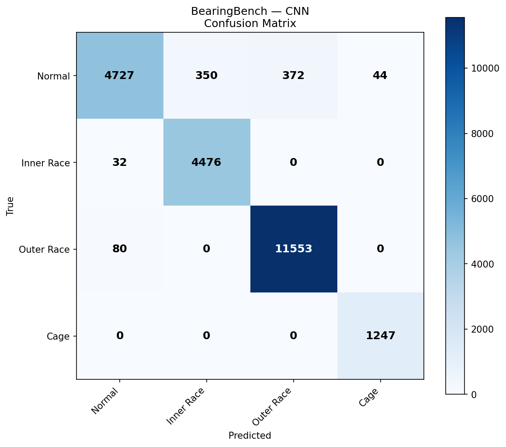

# 🔩 BearingBench — Rolling Element Bearing Fault Detection

<p align="center">
  
  
</p>

<p align="center">
  
  
  
  
  
  
</p>

---

## Overview

BearingBench is an end-to-end deep learning benchmark for rolling element bearing fault detection. It compares four model architectures — CNN, LSTM, BiLSTM, and Transformer — on the XJTU-SY run-to-failure bearing dataset across three operating conditions.

| Fault Class | Label | Bearings |
|---|---|---|
| Normal | 0 | All bearings — first 80% of lifetime |
| Inner Race | 1 | Bearing2_1, Bearing3_3, Bearing3_4 |
| Outer Race | 2 | Bearing1_1-4, Bearing2_2/4/5, Bearing3_1/2/5 |
| Cage | 3 | Bearing1_4, Bearing2_3 |

---

## Results

| Model | Accuracy | Macro F1 | Cage Recall | Cage AUC | Training Time |
|---|---|---|---|---|---|
| **LSTM** | **96.6%** | **0.964** | **1.000** | **1.000** | 12.9 hrs |
| CNN | 96.2% | 0.959 | 1.000 | 1.000 | 73 min |
| BiLSTM | 90.9% | 0.916 | 0.986 | 0.999 | 9.7 hrs |
| Transformer | 63.8% | 0.634 | 0.918 | 0.986 | 5.2 hrs |

> **Key finding:** LSTM outperforms CNN on large bearing datasets (190K samples). With sufficient data, temporal sequential models learn fault impact periodicity better than spatial 2D image models. Transformer underperforms due to dataset size constraints — attention mechanisms require significantly more data to generalize.

---

## Benchmark Comparison: BatteryBench vs BearingBench

| Dataset | Samples | CNN | LSTM | BiLSTM | Transformer |
|---|---|---|---|---|---|
| BatteryBench (NASA) | 636 | **96%** | 57% | 76% | 75% |
| BearingBench (XJTU-SY) | ~190K | 96% | **97%** | 91% | 64% |

**Insight:** Small datasets favor CNN (spatial patterns, fewer parameters). Large datasets favor LSTM (temporal patterns, enough data to learn sequences). Transformers need even more data than LSTM to outperform.

---

## System Architecture

```
Stage 1 — Signal Acquisition
    XJTU-SY CSV files (25,600 Hz · 32,768 samples · 1.28s per file)
    Horizontal + Vertical vibration channels

Stage 2 — Sliding Window Segmentation
    window_size = 1024 points = 40ms (~1.5 shaft revolutions)
    stride      = 512  points (50% overlap)
    63 windows per CSV file

Stage 3 — Database
    MySQL bearingbench database
    working_conditions · bearings · files · model_results tables

Stage 4 — Model Input
    CNN         : (batch, 32, 32, 2)   — 2D spatial image
    LSTM        : (batch, 1024, 2)     — 1D temporal sequence
    BiLSTM      : (batch, 256, 2)      — bidirectional sequence
    Transformer : (batch, 256, 2)      — attention-based sequence
```

---

## Dataset

**XJTU-SY Rolling Element Bearing Dataset**
Wang, B. et al. (2018). XJTU-SY Rolling Element Bearing Dataset.
Xi'an Jiaotong University.

| Condition | RPM | Load | Bearings | CSV Files | Severity Index |
|---|---|---|---|---|---|
| WC1 | 2100 | 12kN | 4 used | 564 | 52,920,000 |
| WC2 | 2250 | 11kN | 5 used | 1,566 | 55,687,500 |
| WC3 | 2400 | 10kN | 5 used | 7,172 | 57,600,000 |
| **Total** | — | — | **14 bearings** | **9,164 files** | — |

**Skipped:** Bearing1_5 (combined Inner+Outer fault — ambiguous label)
**Kept with dominant label:** Bearing3_2 (combined fault → Outer Race)

---

## Window Size Design

```
Sampling frequency : 25,600 Hz (fixed across all conditions)
Samples per CSV    : 32,768
Window size        : 1,024 points = 40ms
Stride             : 512 points (50% overlap)
Windows per CSV    : floor((32768 - 1024) / 512) + 1 = 63
Total windows      : 9,164 × 63 = 577,332

Physical justification:
  WC1 (2100 RPM): 40ms = 1.40 shaft revolutions
  WC2 (2250 RPM): 40ms = 1.50 shaft revolutions
  WC3 (2400 RPM): 40ms = 1.60 shaft revolutions
  → captures at least 1 complete fault impact cycle
```

---

## Model Architectures

### CNN — 2D Image Input
```
Input (32, 32, 2)  ← 1024 points reshaped to 32×32 grid
  → Conv2D(32, L2) → BN → ReLU → Conv2D(32) → BN → ReLU → MaxPool → Dropout(0.2)
  → Conv2D(64, L2) → BN → ReLU → Conv2D(64) → BN → ReLU → MaxPool → Dropout(0.2)
  → Conv2D(128,L2) → BN → ReLU → GlobalAvgPool → Dropout(0.3)
  → Dense(128) → BN → Dropout(0.3)
  → Dense(64)  → BN → Dropout(0.2)
  → Dense(4, softmax) → Normal / Inner / Outer / Cage
```

### LSTM — Sequential Input
```
Input (1024, 2)
  → LSTM(128) → BN → Dropout(0.3)
  → LSTM(64)  → BN → Dropout(0.3)
  → LSTM(32)  → BN → Dropout(0.2)
  → Dense(64) → BN → Dropout(0.2)
  → Dense(4, softmax)
```

### BiLSTM — Bidirectional Sequential
```
Input (256, 2)
  → BiLSTM(128→256) → BN → Dropout(0.3)
  → BiLSTM(64→128)  → BN → Dropout(0.3)
  → BiLSTM(32→64)   → BN → Dropout(0.2)
  → Dense(64) → BN → Dropout(0.2)
  → Dense(4, softmax)
```

### Transformer — Attention-based
```
Input (256, 2)
  → Dense(64)          ← project to d_model=64
  → PositionalEncoding ← sine/cosine position injection
  → [TransformerBlock × 3]
       MultiHeadAttention(4 heads, key_dim=16)
       Add & LayerNorm → FFN(128→64) → Add & LayerNorm
  → GlobalAveragePooling
  → Dense(128) → BN → Dropout(0.3)
  → Dense(64)  → BN → Dropout(0.2)
  → Dense(4, softmax)
```

---

## Class Imbalance Strategy

```
Problem: Normal class dominates (80% of all files)

Strategy 5 — Cap + Class Weights:
  MAX_NORMAL_WINDOWS : 10 per CSV   → reduces Normal dominance
  MAX_FAULT_WINDOWS  : 63 per CSV   → keeps all fault windows

  CLASS_WEIGHTS = {
    Normal     : 1.0   (most common after capping)
    Inner Race : 4.0   (moderately rare)
    Outer Race : 2.0   (moderate)
    Cage       : 15.0  (rarest — 1.4% of files)
  }

Result:
  Normal     : ~73,760 windows  (39%)
  Outer Race : ~77,553 windows  (41%)
  Inner Race : ~30,051 windows  (16%)
  Cage       :  ~8,316 windows   (4%)
  Total      : ~189,680 samples
```

---

## Project Structure

```
BearingBench/
│
├── data/
│   ├── WC1/          ← Bearing1_1 to Bearing1_5 CSV files
│   ├── WC2/          ← Bearing2_1 to Bearing2_5 CSV files
│   ├── WC3/          ← Bearing3_1 to Bearing3_5 CSV files
│   ├── cache/        ← sequences.pkl + images.pkl (auto-generated)
│   └── schema.sql    ← MySQL schema
│
├── src/
│   ├── db.py                    ← MySQL connection (WSL + Windows)
│   ├── data_loader.py           ← sliding window + fault labels
│   ├── bridge_csv_to_sql.py     ← CSV metadata → MySQL
│   ├── trainer.py               ← CNN + LSTM + BiLSTM + Transformer
│   └── fix_seq_len.py           ← utility to change SEQ_LEN
│
├── models/
│   ├── cnn_best.h5
│   ├── lstm_best.h5
│   ├── bilstm_best.h5
│   └── transformer_best.h5
│
├── results/
│   ├── cnn_history.png
│   ├── lstm_history.png
│   ├── bilstm_history.png
│   ├── transformer_history.png
│   ├── *_confusion_matrix.png
│   ├── *_roc_curve.png
│   └── benchmark_report.txt
│
└── docs/
    └── BearingBench_Window_Size_Report.docx
```

---

## Installation

### Prerequisites
- Python 3.10
- NVIDIA GPU (tested on RTX 4060 8GB Laptop)
- MySQL 8.0
- TensorFlow 2.10

### Setup

```bash
git clone https://github.com/shamidou97/BearingBench.git
cd BearingBench
pip install tensorflow==2.10.1 scipy numpy pandas matplotlib seaborn scikit-learn sqlalchemy mysql-connector-python flask
```

### Download Dataset

Download XJTU-SY from MediaFire:
```
http://www.mediafire.com/folder/m3sij67rizpb4/XJTU-SY_Bearing_Datasets
```

Extract all 3 working condition archives into `data/`:
```
data/WC1/Bearing1_1/ ... Bearing1_5/
data/WC2/Bearing2_1/ ... Bearing2_5/
data/WC3/Bearing3_1/ ... Bearing3_5/
```

### Database Setup

```bash
sudo mysql -e "CREATE DATABASE bearingbench;"
sudo mysql -e "CREATE USER 'bearinguser'@'%' IDENTIFIED BY 'bearing123';"
sudo mysql -e "GRANT ALL PRIVILEGES ON bearingbench.* TO 'bearinguser'@'%';"
sudo mysql bearingbench < data/schema.sql
python src/bridge_csv_to_sql.py
```

---

## Usage

### Build dataset cache and train all models

```bash
python src/trainer.py 2>/dev/null
```

### Query results from MySQL

```bash
sudo mysql bearingbench -e "SELECT * FROM v_model_comparison;"
```

### Expected output

```
Model        Accuracy  MacroF1  CageRecall  CageAUC
LSTM           96.6%    0.964     1.000      1.000
CNN            96.2%    0.959     1.000      1.000
BiLSTM         90.9%    0.916     0.986      0.999
Transformer    63.8%    0.634     0.918      0.986
```

---

## Training Configuration

```python
# Shared
BATCH_SIZE     : 64 (CNN/LSTM) · 128 (BiLSTM/Transformer)
EPOCHS         : 80 (CNN/LSTM) · 50 (Transformer)
OPTIMIZER      : Adam
CLASS_WEIGHTS  : {Normal:1.0, Inner:4.0, Outer:2.0, Cage:15.0}

# CNN
IMG_H, IMG_W   : 32 × 32
LR             : 1e-3

# LSTM
SEQ_LEN        : 1024
LR             : 1e-3

# BiLSTM / Transformer
SEQ_LEN        : 256
LR             : 3e-4

# Transformer
D_MODEL        : 64
N_HEADS        : 4
D_FF           : 128
N_BLOCKS       : 3
```

---

## Key Design Decisions

**1. Boundary file exclusion**
Files at 75-85% of bearing lifetime show early fault signatures but are labeled Normal (80/20 split). Excluding these boundary files eliminates validation loss spikes observed across all models.

**2. Severity Index**
Operating conditions ranked by SI = Force × RPM²: WC3 (57.6M) > WC2 (55.7M) > WC1 (52.9M). WC3 bearings degrade fastest despite lowest force because RPM² dominates.

**3. Why LSTM beats CNN on large datasets**
Bearing vibration signals contain periodic fault impacts (ball pass frequency). LSTM captures this periodicity sequentially. CNN sees it as a 2D spatial pattern — less natural for periodic signals. With 190K samples, LSTM has enough data to learn these temporal patterns.

**4. Transformer limitation**
Self-attention requires learning which timesteps are important across 256 positions. With ~190K samples this is insufficient — BERT required 3.3 billion tokens. Transformer would likely outperform with cross-dataset pretraining (e.g., CWRU dataset).

---

## Future Work

- [ ] CWRU dataset pretraining → XJTU-SY fine-tuning (transfer learning)
- [ ] Cross-condition generalization: train WC1+WC2, test WC3
- [ ] Mixed precision training (float16) for 2× speedup
- [ ] Remaining Useful Life (RUL) regression
- [ ] Deploy as REST API with Docker

---

## Citation

```bibtex
@dataset{xjtu_sy_2018,
  author    = {Wang, Biao and Lei, Yaguo and Li, Naipeng and Li, Ningbo},
  title     = {A Hybrid Prognostics Approach for Estimating Remaining
               Useful Life of Rolling Element Bearings},
  journal   = {IEEE Transactions on Reliability},
  year      = {2018},
  doi       = {10.1109/TR.2018.2882682}
}
```

---

## Related Projects

| Project | Description | Link |
|---|---|---|
| CellSentinel | Li-ion Battery Fault Detection · CNN · 96% accuracy | [GitHub](https://github.com/shamidou97/CellSentinel) |
| BatteryBench | Battery Model Comparison · CNN vs LSTM vs Transformer | Coming soon |
| BearingBench | Bearing Fault Detection · 4-model benchmark | This repo |

---

<p align="center">
Built with TensorFlow · XJTU-SY Dataset · RTX 4060 GPU · MySQL
</p>
